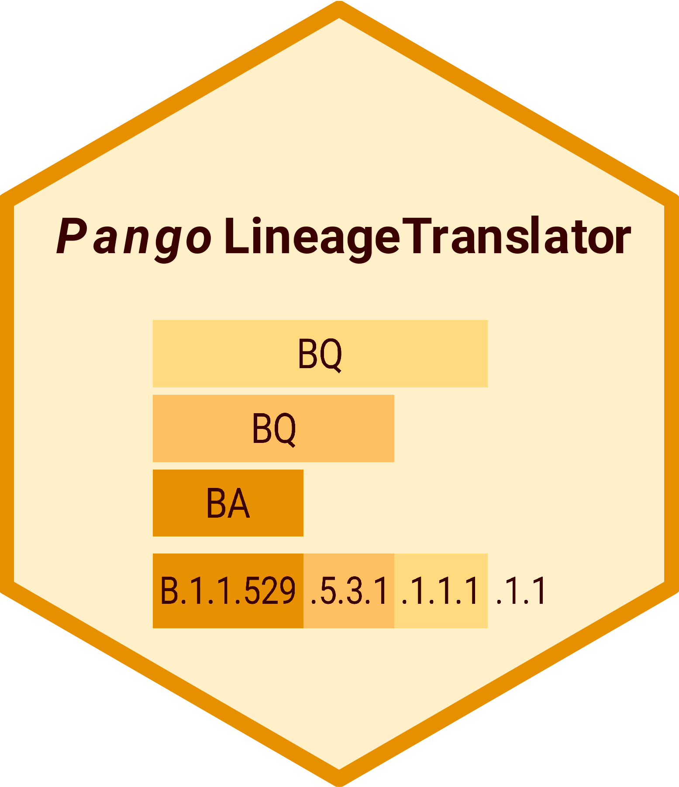
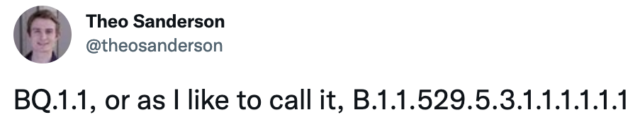
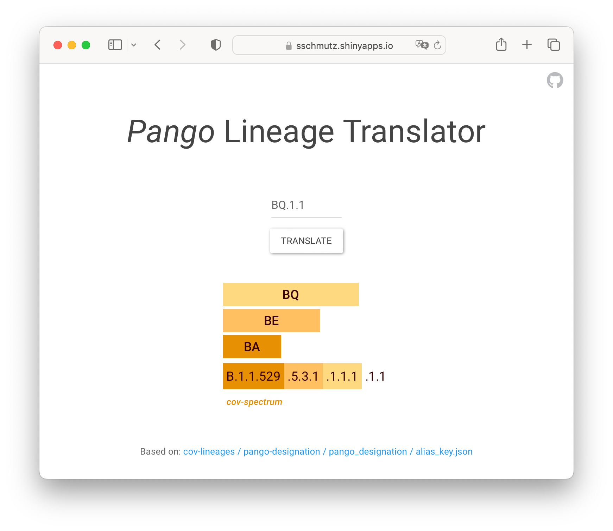
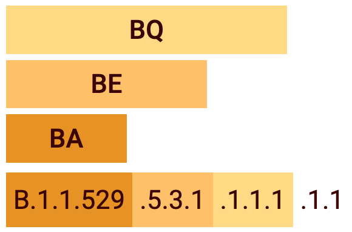

<!-- README.md is generated from README.Rmd. Please edit that file -->

```{r, include = FALSE}
knitr::opts_chunk$set(
  collapse = TRUE,
  comment = "#>",
  fig.path = "man/figures/README-",
  out.width = "100%"
)

devtools::load_all()
```

# *Pango* Lineage Translator <a href='https://sschmutz.shinyapps.io/PangoLineageTranslator/'></a>

Understand the hierarchical structure of Pango-lineage names.
<br>
<br>

## Background

The [*Pango* Lineage Translator App](https://sschmutz.shinyapps.io/PangoLineageTranslator/) was inspired by a series of similar tweets making fun of the growing length of full SARS-CoV-2 Pango Lineage names. For example:  

<div>
<a href='https://twitter.com/theosanderson/status/1572537385250070529?t=2-MfB36IsUaZ-HVsIEH5pg&s=03'>

</a>
</div>

<br>

These two names do indeed describe the same Pango Lineage and are synonyms, only that the short form uses [defined aliases](https://github.com/cov-lineages/pango-designation/blob/master/pango_designation/alias_key.json) to abbreviate the long form.  

With the evolution of SARS-CoV-2, a structured solution to designate and name
new lineages was required.  
The idea and implementation of naming lineages using the Pango nomenclature system
are well described on the [Pango Network website](https://www.pango.network/the-pango-nomenclature-system/statement-of-nomenclature-rules/).  
The side effect of such a nomenclature system is that:  
- from the abbreviated names, it is not easy to track its ancestry, and  
- the non-abbreviated names get pretty long.  

Here is where this App tries to bring everything together and illustrate the ancestry of abbreviated Pango Lineage names by highlighting all the aliases of the full name.

<div align="left">
<a href='https://sschmutz.shinyapps.io/PangoLineageTranslator/'>

</a>
</div>

## How it works

The first step is to translate and remove all aliases of a given lineage name to get the full name.

```{r example_translate_lineage}
(pango_lineage_full <- translate_lineage("BQ.1.1"))
```

Next, aliases are assigned again to the relevant parts of the full lineage name. There might be a remainder that can not be further abbreviated at the end.

```{r example_divide_lineage}
(pango_lineage_full_tibble <- divide_lineage(pango_lineage_full))
```

Different color schemes are used to highlight the different variants of concern [defined by the WHO](https://www.who.int/activities/tracking-SARS-CoV-2-variants), such as <a style='font-weight:500;background-color:#E69000;color:#3A0301;padding: 5px 5px 5px 5px;'>Omicron</a>.

```{r example_VOC_color}
(color_vector <- VOC_color(pango_lineage_full))
```

Lastly, a [gt table](https://gt.rstudio.com/) is put together with nested [spanner column labels](https://gt.rstudio.com/reference/tab_spanner.html) for each alias and a direct link to [cov-spectrum](https://cov-spectrum.org/explore/Switzerland/AllSamples/Past6M) as footnote where one can find more details about the selected lineage.

```{r example_table, eval=FALSE}
create_pango_lineage_table(pango_lineage_full_tibble, color_vector)
```

<div align="left">

</div>

